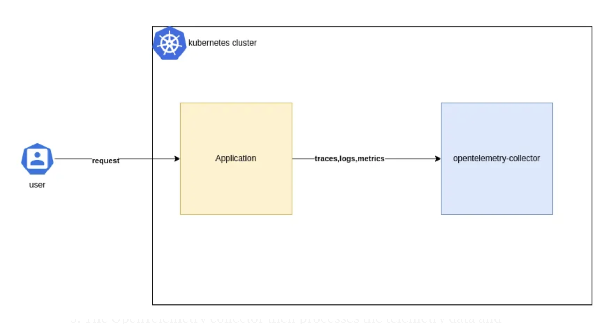

## Project setup

1. Complete HOST and ALB_PORT in .env file
2. npm install
3. npm run proto:gen

## How to test for EKS

1. npm run client:eks

## How to test for ECS

1. npm run client:ecs
2. curl http://localhost:3000/api/healthchek

## Otel workflow
user request -> application send trace, log, metric -> otel collector receive and process

Refer: 
Setup
- https://opentelemetry.io/docs/languages/js/getting-started/nodejs/
- https://opentelemetry.io/docs/languages/js/instrumentation/

Correlating OpenTelemetry Traces and Logs
- https://docs.datadoghq.com/tracing/other_telemetry/connect_logs_and_traces/opentelemetry/?tab=nodejs

## How to setup otel trace in source nodejs

1. add file tracer.ts
2. To correlating OpenTelemetry Traces and Logs => add logger.ts
2. add env in gitops source at path chart/service/devops-demo-app/templates/_helpers.tpl:
- name: "OPENTELEMETRY_COLLECTOR_IP"
  valueFrom:
    fieldRef:
      fieldPath: "status.hostIP"
- name: "OTEL_EXPORTER_URL"
  value: "http://$(OPENTELEMETRY_COLLECTOR_IP):4318/v1/traces"
3. change script in package.json: "docker": "ts-node --require ./tracer.ts server"

4. add config trace in gitops source at path: chart/tool/otel/overlays/{ENV}/worker/{region}/config/otel-agent-config

service:  
  pipelines:  
    traces:
      receivers: [otlp]
      processors: [attributes, batch, k8sattributes]
      exporters: [logging, datadog]

5. Add datadog config in gitops source at path: chart/tool/otel/overlays/{ENV}/worker/{region}/config/otel-agent-config

exporters:
  datadog:
    host_metadata:
      tags: [env:{ENV}, Orchestration:EKS]
    api:
      site: datadoghq.com
      key: "key"

Refer:
- https://signoz.io/docs/logs-management/send-logs/nodejs-winston-logs/#collecting-nodejs-logs-when-application-is-deployed-on-docker-or-kubernetes
- https://signoz.io/docs/instrumentation/opentelemetry-javascript/#steps-to-auto-instrument-nodejs-application

# TODO:
- Config ddsource env value for datadog for opentelemetry sdk. 
  - Add attribute ddsource in otel logs request. Not attribute resource.
  - https://github.com/DataDog/opentelemetry-mapping-go/issues/355
  - https://docs.datadoghq.com/getting_started/tagging/unified_service_tagging?tab=kubernetes

- tags for logfile compine with signo and datadog: 
 - add resource attribute with format: service_name:service_name, service_version:service_version
 - https://signoz.io/docs/azure-monitoring/virtual-machines/vm-metrics/#file-logs-receiver-configuration
 - https://github.com/open-telemetry/opentelemetry-collector-contrib/blob/main/processor/resourcedetectionprocessor/README.md
 - https://github.com/open-telemetry/opentelemetry-collector-contrib/issues/26989
 - https://github.com/open-telemetry/opentelemetry-collector-contrib/tree/main/processor/transformprocessor#contexts --->  Solution.
 - https://github.com/open-telemetry/opentelemetry-collector-contrib/blob/main/receiver/filelogreceiver/README.md ---> Solution.
    filelog/nodejs-example:
          attributes:
            ddsource: nodejs
            service: devops-demo-app-dev
          resource:
            service.name: devops-demo-app-dev

- Enable/Disable otel trace in source code
- Only send logs.
- Add more log level. 
- Export metrics cpu/memory 's Pod. 
  - Pipeline: metrics
  - x2 Host infra Host datadog.
  
- Parse logs, filter logs which want sent to datadog, signoz. Filter processors for unwanted logs
  - Parsing logs with the OpenTelemetry Collector | SigNoz
  - https://signoz.io/blog/parsing-logs-with-the-opentelemetry-collector/
  - https://signoz.io/blog/opentelemetry-logs/
  - https://github.com/open-telemetry/opentelemetry-collector-contrib/blob/main/receiver/filelogreceiver/README.md
  - https://signoz.io/blog/opentelemetry-logs/
 
- Parse logs for https code from body nginx. and dashboard for this.
  - to query log error code from nginx service.
  - https://www.elastic.co/guide/en/integrations/current/nginx_ingress_controller_otel.html
  - https://kubernetes.github.io/ingress-nginx/user-guide/nginx-configuration/configmap/#log-format-upstream

- Ingress for grpc
- Authen with key :
  - https://github.com/open-telemetry/opentelemetry-collector/blob/main/config/configauth/README.md
- Infra host on all pod 
